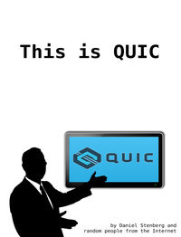

**HTTP/3 explained** is a collaborative effort to document the HTTP/3 and the
QUIC protocols. Join in and help!

Get the Web or PDF versions on
[http3-explained.haxx.se](https://http3-explained.haxx.se/).

The contents get updated automatically on every commit to this git repository.

