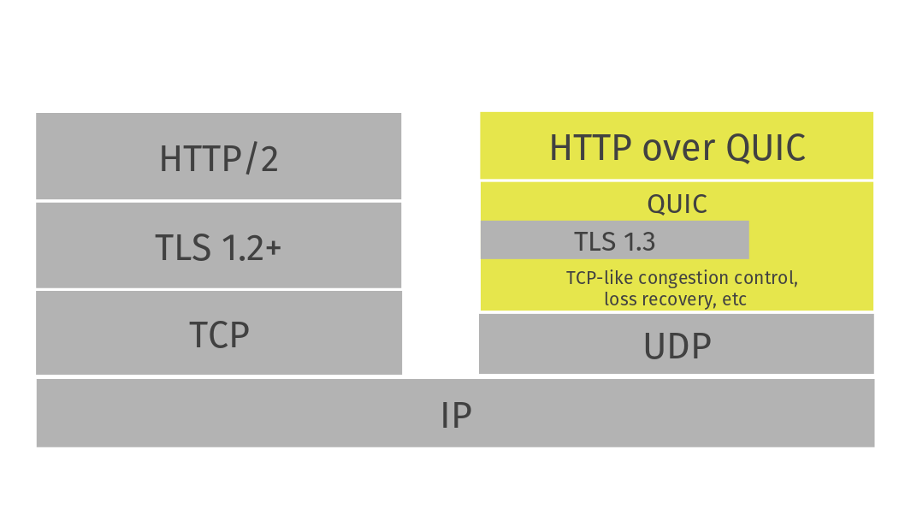

<!--
# Protocol features

The QUIC protocol from a high level.

Illustrated below is the HTTP/2 network stack on the left and the QUIC network
stack on the right, when used as HTTP transport.

-->

# 프로토콜 기능

고수준에서 QUIC 프로토콜을 보자.

아래 그림에서 HTTP 전송할 때 HTTP/2 네트워크 스택은 왼쪽에 QUIC 네트워크 스택은 오른쪽에 나와 있다.

