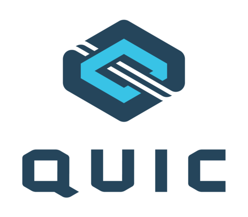

<!--
# Why QUIC

QUIC is a name, not an acronym. It is pronounced exactly like the English word
"quick".

QUIC is in many ways what could be seen as a way of doing a new reliable and
secure transport protocol that is suitable for a protocol like HTTP and that
can address some of the known shortcomings of doing HTTP/2 over TCP and
TLS. The logical next step in the web transport evolution.

QUIC is not limited to just transporting HTTP. The desire to make the web and
data in general delivered faster to end users is probably the largest reason
and push that initially triggered the creation of this new transport protocol.

So why create a new transport protocol and why do it on top of UDP?

-->

# 왜 QUIC인가

QUIC은 약어가 아니라 이름이다. 영어단어 "quick"과 똑같이 발음한다.

QUIC은 많은 부분에서 HTTP 같은 프로토콜에 적합하다. TCP와 TLS에서 동작하는
HTTP/2의 단점으로 알려진 문제를 해결하면서 안정적이고 안전한 새 전송 프로토콜로 볼 수 있다.

QUIC은 HTTP 전송에만 국한되지 않는다. 최종 사용자에게 웹과 데이터를 더 빨리 전달하려는 바람이
초기 이 새로운 전송 프로토콜을 만들게 된 가장 큰 이유이자 원동력이다.

그러면 새로운 전송 프로토콜은 왜 만들고 왜 UDP 상에서 동작하게 했는가?

